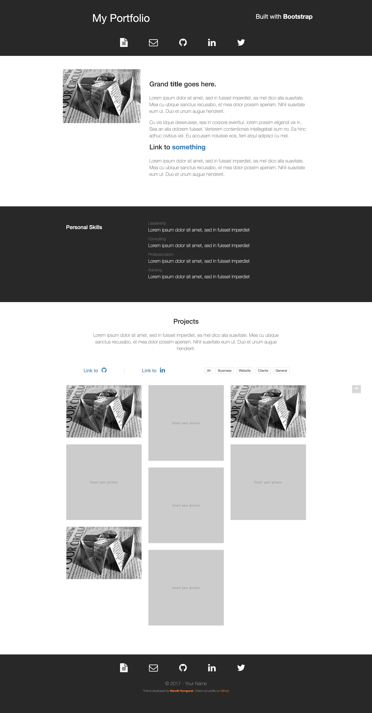

# One-Page Portfolio HTML Website

This is a beautiful, yet modern single-page portfolio. The white-against-black monotone allows your content to shine through easily. 

## Getting Started

Getting started right away is super easy. You can download the actual assets (HTML, CSS, and JavaScript files) by acccessing this link: [https://github.com/naruthk/web-theme-portfolio/raw/master/theme.zip](https://github.com/naruthk/web-theme-portfolio/raw/master/theme.zip).

## Demo
A live version is hosted on CodePen.



## Development

If you are a developer interested in adding your own customizations, you will need to follow the steps below.

### System Requirements

- Node.js
- Gulp (for file processing and bundling)

### Build

1. Clone the repository: git clone https://github.com/naruthk/web-theme-portfolio.git
2. Install required packages using `npm install`
3. Run `gulp copy` which will output a `dist` folder that contains the necessary files to properly display the website on any browser
4. To create a production build, please run `gulp watch`

### Project Structure

```
./
├── package.json
├── gulpfile.js                                * gulp tasks & config
├── README.md
|
├── screenshots/                               * test screenshots
|
├── index.pug                                  * pug file for homepage
|
├── scss/                                      * scss files
│   ├── _base.scss                             * typography, fonts, general styling
│   ├── _layout.scss                           * layout settings
│   ├── _modals.scss
│   ├── _theme.scss                            * theme of the webpage (most important)
│   ├── _variables.scss                        * variables
│   ├── main.scss                              * compiles all above scss files into a single file
│
└── dist/                                     * built source
	├── index.html
	├── main.css
    ├── theme.js
```

`Bootstrap`, `jQuery`, and `Font Awesome` libraries are also used but are provided from external CDNs only.

----

## Support

Please submit a new issue on this GitHub's repository if you encounter any problem or have any suggestion. 

---

Made with 💌. Thank you!

---

## License

[MIT](https://github.com/naruthk/web-theme-portfolio/blob/master/LICENSE)

Use of this material is, at all times, "at your own risk." If you are dissatisfied with any aspect of the material, any of these terms and conditions or any other policies, your only remedy is to discontinue the use of the material. In no event shall I, the author be liable to any user or third party, for any damages whatsoever resulting from the use or inability to use this material upon this site, whether based on warranty, contract, tort, or any other legal theory, and whether or not the website is advised of the possibility of such damages.
